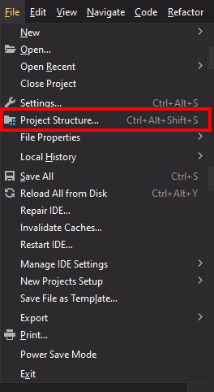
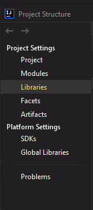
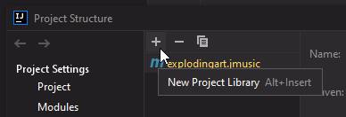
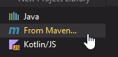
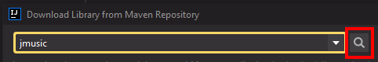
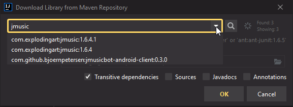

# music-composer
A music composition software utilizing jMusic to generate song ideas for musicians

Documentation available here: https://explodingart.com/jmusic/jmtutorial/t1.html

## Jmusic Installation Instructions for IntelliJ users

Click on File and then Project Structure

On the sidebar, click on Libraries

Click on the "plus" icon to add a New Project Library

Then click on "From Maven" and a popup should display

Type in 'jmusic' and click the hourglass icon (indicated in red) to search 

Finally, click on the latest version (here shown as 1.6.4.1) and then click OK to finish.

